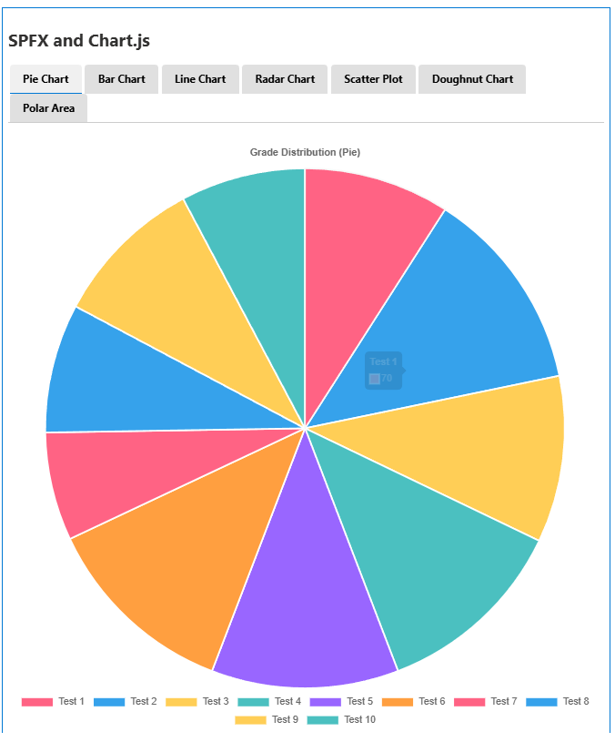
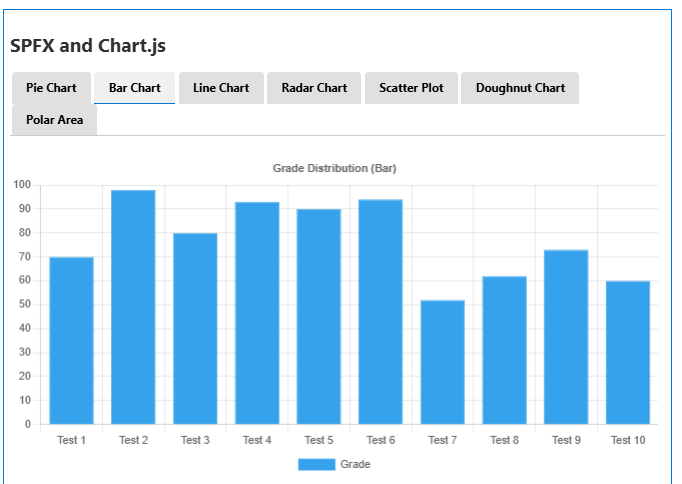
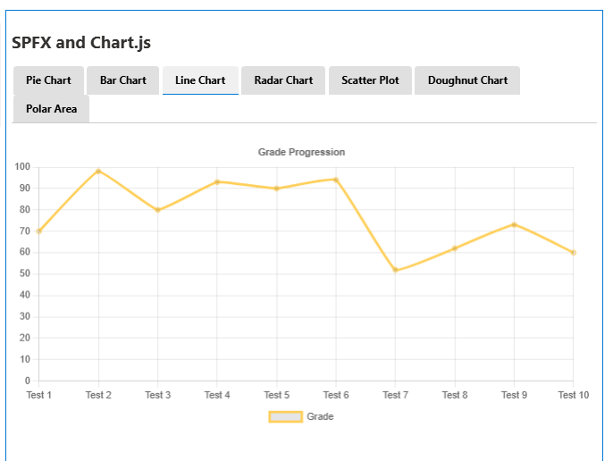
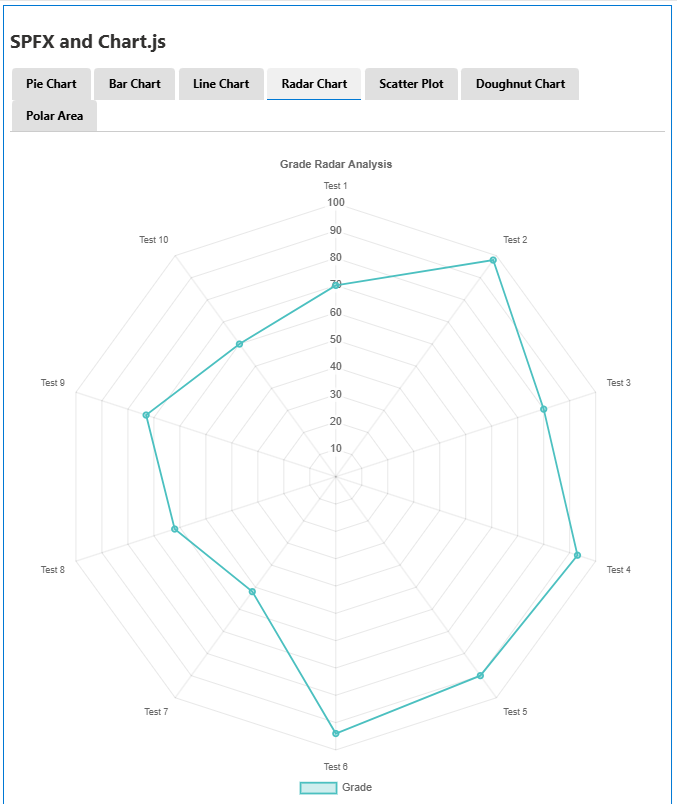
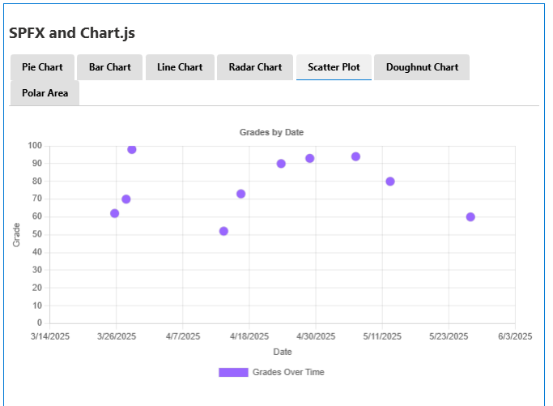
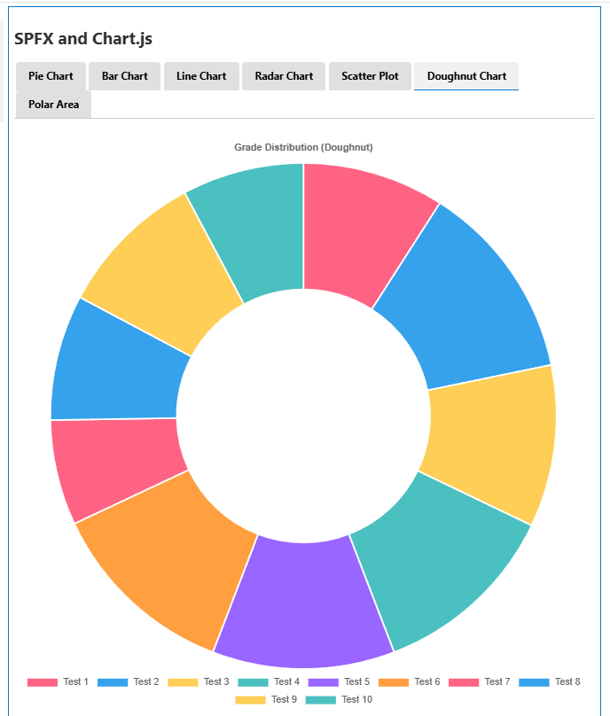
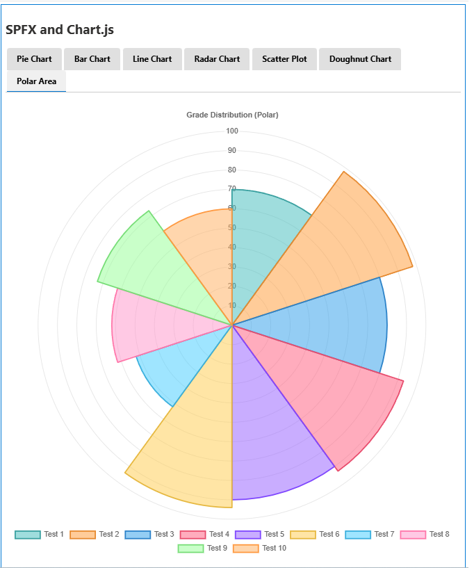

# SPFX Basic Charts

A SharePoint Framework web part that displays various chart types using Chart.js, including:
- Pie Chart
- Bar Chart
- Line Chart
- Radar Chart
- Scatter Plot
- Doughnut Chart
- Polar Area Chart

## Chart Types Preview

### Pie Chart


### Bar Chart


### Line Chart


### Radar Chart


### Scatter Plot


### Doughnut Chart


### Polar Area Chart


## Prerequisites

- Node.js version 16+
- SharePoint Online tenant

## Getting Started

1. Clone this repository
2. Navigate to the project directory
3. Install dependencies:
   ```bash
   npm install
   ```
4. Update the `config/serve.json` file with your SharePoint site URL:
   ```json
   {
     "initialPage": "https://YOUR-TENANT.sharepoint.com/sites/YOUR-SITE/_layouts/workbench.aspx"
   }
   ```
5. Serve the project:
   ```bash
   gulp serve
   ```

## Features

- Multiple chart types
- Dynamic data loading from SharePoint list
- Responsive design
- Interactive charts with tooltips and legends

## Configuration

The web part reads data from a SharePoint list named 'Grades-N-Such' with the following columns:
- Title (text)
- Grade (number)
- Date (date)

## Building and Deploying

To build and deploy to SharePoint:

1. Build the project:
   ```bash
   gulp build
   ```
2. Bundle and package:
   ```bash
   gulp bundle --ship
   gulp package-solution --ship
   ```
3. Deploy the .sppkg file from the sharepoint/solution folder to your SharePoint App Catalog

## Contributing

Pull requests are welcome. For major changes, please open an issue first to discuss what you would like to change.


